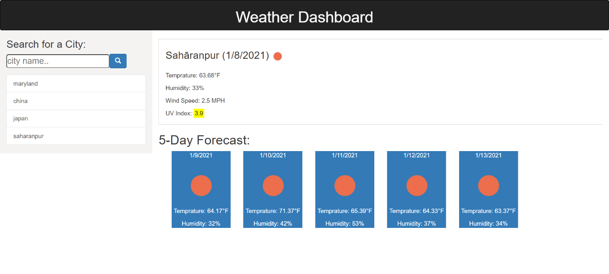

# Weather-Dashborad

## Contents

* [Introduction](#Introduction)
* [Technologies](#Technologies)
* [Screenshot](#Screenshot)
* [Link](#Link)

## Introduction

The Weather-Dashborad project allow a user to see the weather outlook for multiple cities so that he can plan a trip accordingly. When user  search for a city he gets the  update for the current day and 5 day forecast. Whenever user load the page again he will be presented with the last searched city.

## Technologies

Project is created with:

* Visual Studio Code 1.51.1
* Jquery 3.2.1
* Bootstrap 3.4.1
* API :https://openweathermap.org/api

## Screenshot

## Link

[Weather Dashboard](https://panwaramita.github.io/Weather-Dashboard/)